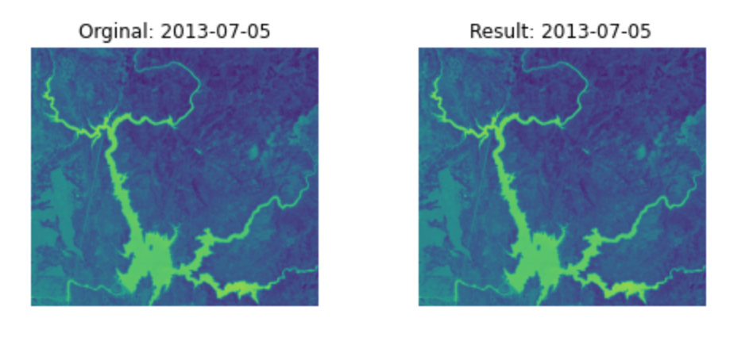
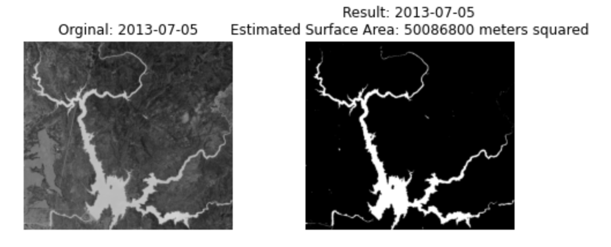
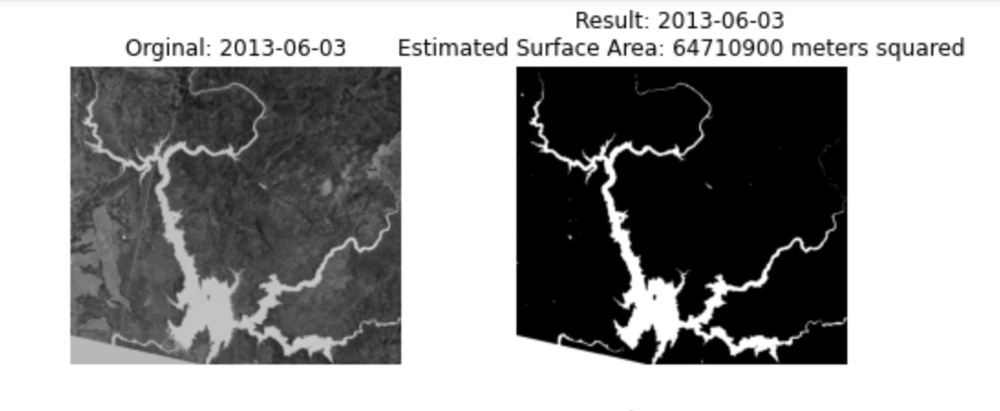
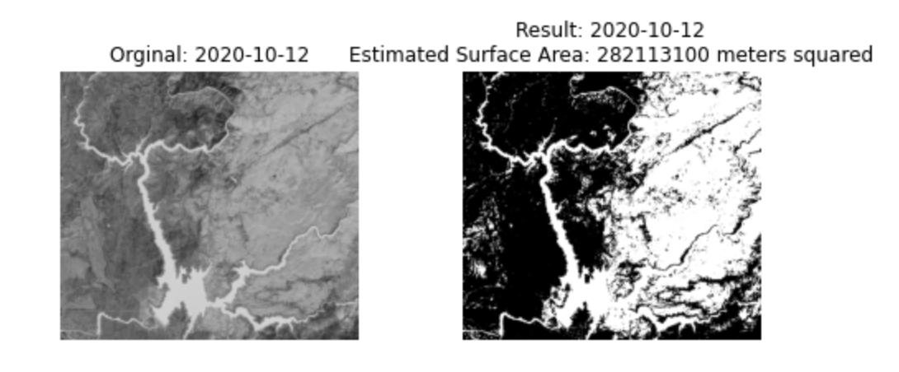
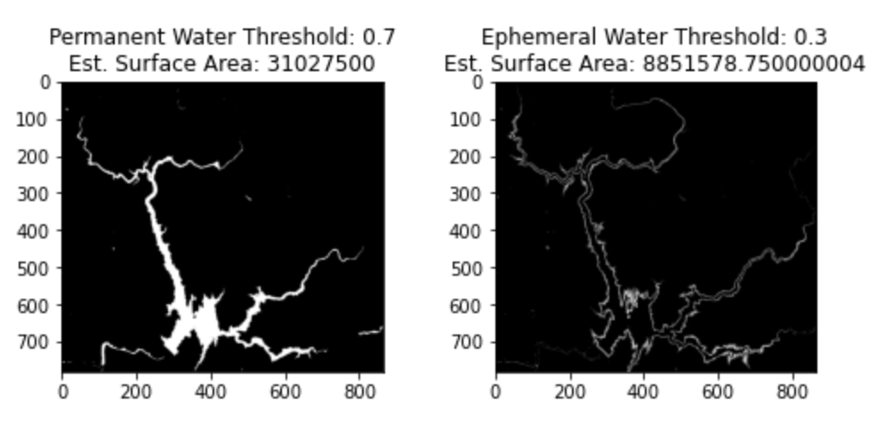

# **Changes in the Area of Surface Water in Lake Oroville**

## **Abstract**

    Surface water has an important relationship with both the climate and human well being, thus it is important for us to monitor and support these bodies of water as the climate continues to change. We used images captured with varying wavelengths on the electromagnetic spectrum to identify differences between water and non-water areas, and to analyze how these bodies of water change over time.

##  **1. Introduction**

### **1.1 Intro**

    

        Lake Oroville is a reservoir formed by the Oroville Dam located in northern California. The lake is 5 miles northeast of the city of Oroville, within the Lake Oroville State Recreation Area. It is known as the second-largest reservoir in California and stores water, provides flood control, and provides recreation for the residents in the area.
    

    

        
    

    

        Image of Lake Oroville
    

    

        There has been a growing discussion on the topic of water restriction in recent years. More specifically, in the state of California the concern of water shortages, alongside a growing fear of water limitations, has been imposed on its residents. Of course, there are a number of variables that contribute to the state's ongoing issue. Nevertheless, in the past couple of decades these concerns have only seemed to elevate as the changing climate continues to aggressively deplete California's water reserves. An essential resource required for the sustainability of the state’s immense agricultural industry, and its dense population. We examined the spatial and temporal changes of Lake Oroville using 80 images collected by the LANDSAT satellite. 
    

### **1.2 Literature Review**

### **1.3 Data Description**

    We use satellite images taken from the USGS Landsat 8 surface reflectance dataset, where there are 9 spectral bands available for us to use captured every 2 weeks with a 30 meter resolution. The images captured in this dataset date back to April of 2013 to present time, and allow us to view how surface water has changed within the last decade. With the various spectral bands captured by the satellite we can distinguish between surface water and non surface water areas.

 

    In order to compare and quantify how accurate our model estimated surface water was, satellite imagery was collected from JRC Monthly Water History, v1.4 from Google Earth Engine Catalog. This dataset was developed by Pekel el al. [4] and demonstrated to be the most reliable way to compare our results. Due to the fact that their findings, research, and methodologies are well respected in the satellite imagery domain. Therefore, we reasoned that it would provide for validation data. 

## **2. Methods**

### **2.1 ETL**

### **2.1 EDA**

### **2.1 Water Detection**

    In order to classify water and non-water areas we used an image processing technique called thresholding. In our implementation we utilized the Scikit Image library to determine the thresholds for water and non-water areas.  This method created a clear separation between the water and non-water areas.
    

        <b>NDWI Image</b>
    

    

        
    

    

        <b>SciKit Image Thresholded Image</b>
    

    

        
    

## **3. Results**

        <b>Successfully Thresholded Image</b>

    

        <b>Thresholded Image with Missing Data</b>

    

        <b>Thresholded Image with Cloud Noise</b>

    

    After discarding images with missing data and noise, we performed more analysis on the successfully classified images. Specifically we looked to determine where the permanent and ephemeral water resided within Lake Oroville. To clarify, ephemeral water is water that only flows in response to precipitation and lacks a clearly defined channel. We defined ephemeral water as water that does not appear in greater than 70% of our images. 

        <b>Permanent Water with Threshold of 70%</b>

    

## **4. Discussion**

    As seen in our results section, our current model produces results that fall into one of three categories: successful thresholding, failure due to missing data, or failure due to noise. Most of our data can be successfully thresholded with our current methods, however there are some processed NDWI images that were generated with missing data thus implying water where there should not be. Another failed scenario occurs when the images captured by LANDSAT are muddied by clouds or other noise that cause specific bands to be nearly unusable. We also found a general upward trend of water surface area until about 2021, where there was a sharp drop-off. This can be observed in Table n and Figure n, however we do not have much confidence in the validity of these results as the amount of  image data varies from year to year, which would ultimately affect our surface area estimates.

    Our results are similar to other granular analysis of small bodies of water up until 2020, as an analysis of inland water in Sri Lanka [2] found a similar upwards trend in water surface area. However, our results require more image data to increase the confidence level of our predictions. Our approach is limited upon the availability of image data for Lake Oroville, and the time limitation for this quarter. Our approach can be improved upon by 1. obtaining more image data and 2. preparing the images through a pre-processing pipeline in order to mitigate noise and other issues as much as possible. More in depth analysis on the channels of water from Lake Oroville as well as the intra-annual changes and patterns would also be an interesting topic to further explore.

## **5. References**

    [1] Fengming Hui, Bing Xu, Huabing Huang, Qian Yu & Peng Gong (2008) Modelling spatial-temporal change of Poyang Lake using multitemporal Landsat imagery, International Journal of Remote Sensing, 29:20, 5767-5784, DOI: 10.1080/01431160802060912

    [2] Li, J., Wang, J., Yang, L. et al. Spatiotemporal change analysis of long time series inland water in Sri Lanka based on remote sensing cloud computing. Sci Rep 12, 766 (2022). <a href="https://doi.org/10.1038/s41598-021-04754-y">https://doi.org/10.1038/s41598-021-04754-y</a>

    [3] Özelkan, E. (2020). Water Body Detection Analysis Using NDWI Indices Derived from Landsat-8 OLI. Polish Journal of Environmental Studies, 29(2), 1759-1769. <a href="https://doi.org/10.15244/pjoes/110447">https://doi.org/10.15244/pjoes/110447</a>

    [4] Pekel, JF., Cottam, A., Gorelick, N. et al.	High-resolution mapping of global surface water and its long-term changes. Nature 540, 418–422 (2016). <a href="https://doi.org/10.1038/nature20584">https://doi.org/10.1038/nature20584</a>

