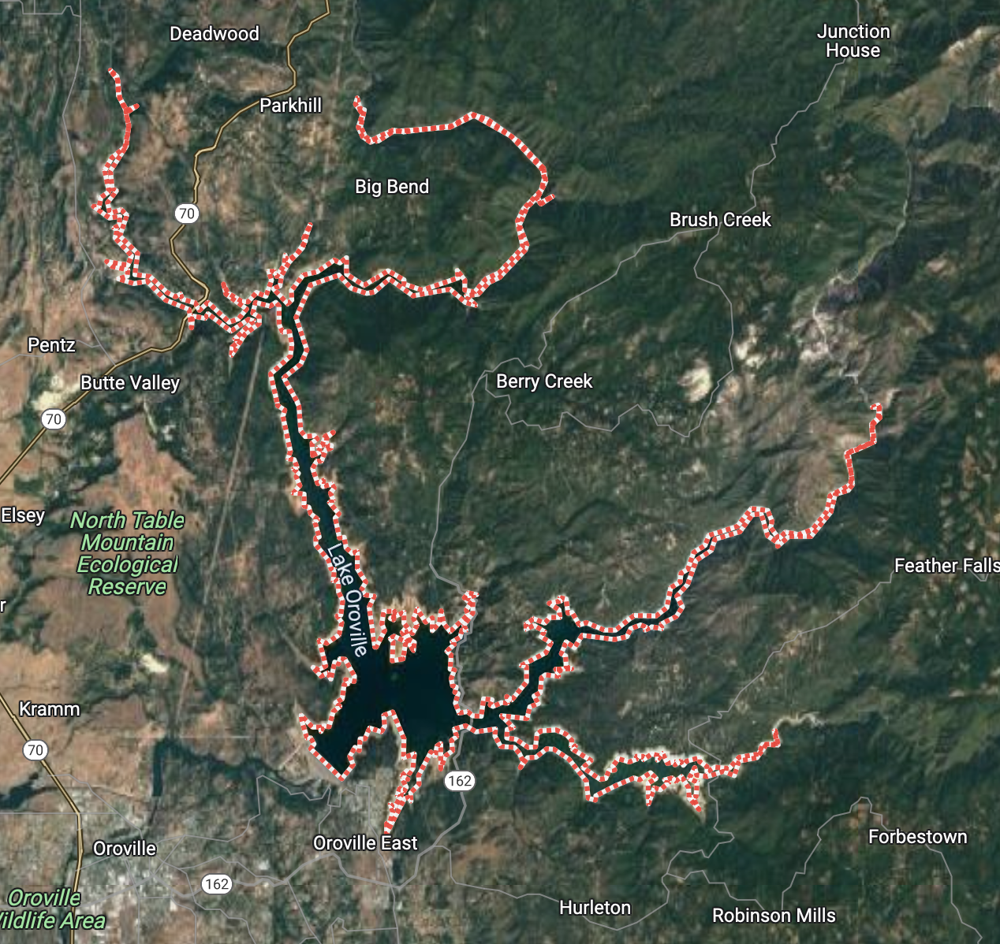

##  **Introduction**

    

        Lake Oroville is a reservoir formed by the Oroville Dam located in northern California. The lake is 5 miles northeast of the city of Oroville, within the Lake Oroville State Recreation Area. It is known as the second-largest reservoir in California and stores water, provides flood control, and provides recreation for the residents in the area.
    

    

        
    

    

        Image of Lake Oroville
    

    

        There has been a growing discussion on the topic of water restriction in recent years. More specifically, in the state of California the concern of water shortages, alongside a growing fear of water limitations, has been imposed on its residents. Of course, there are a number of variables that contribute to the state's ongoing issue. Nevertheless, in the past couple of decades these concerns have only seemed to elevate as the changing climate continues to aggressively deplete California's water reserves. An essential resource required for the sustainability of the state’s immense agricultural industry, and its dense population. We examined the spatial and temporal changes of Lake Oroville using 80 images collected by the LANDSAT satellite. 
    

### **Data Description**

    We use satellite images taken from the USGS Landsat 8 surface reflectance dataset, where there are 9 spectral bands available for us to use captured every 2 weeks with a 30 meter resolution. The images captured in this dataset date back to April of 2013 to present time, and allow us to view how surface water has changed within the last decade. With the various spectral bands captured by the satellite we can distinguish between surface water and non surface water areas.

 

    In order to compare and quantify how accurate our model estimated surface water was, satellite imagery was collected from JRC Monthly Water History, v1.4 from Google Earth Engine Catalog. This dataset was developed by Pekel el al. [4] and demonstrated to be the most reliable way to compare our results. Due to the fact that their findings, research, and methodologies are well respected in the satellite imagery domain. Therefore, we reasoned that it would provide for validation data. 

