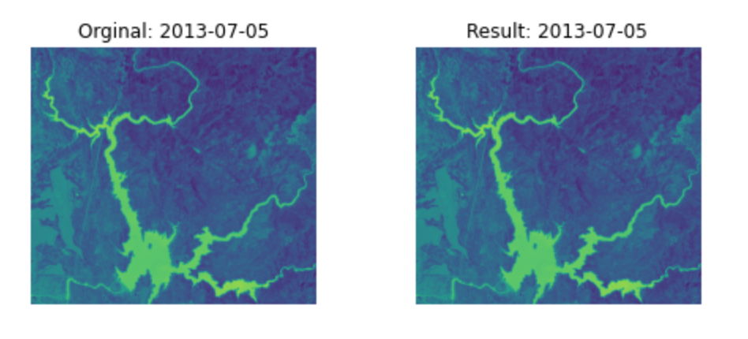

## **Methods**

### **ETL**
Google Earth Engine was our primary method for data collection, as it provides a flexible and robust API to extract, transform, and load satellite image data. This process was initiated by using built in functions to select and filter Landsat 8 images based on a desired time frame.
We selected the earliest date USGS Landsat 8 Level 2, Collection 2, Tier 1 allowed, which was March 18, 2023. Our end date was selected in the same fashion, providing at the time was October 24, 2022.

The images were then exported and downloaded locally using geemap, a third party library. As mentioned previously, we utilized a dataset from Pekel et. al [4] that used a proprietary system to classify water and non-water areas. This dataset was used as validation data in order to improve the accuracy of our model, and to make sure that our surface area estimations were reasonable.

### **Water Detection**

    In order to classify water and non-water areas we used an image processing technique called thresholding. In our implementation we utilized the Scikit Image library to determine the thresholds for water and non-water areas.  This method created a clear separation between the water and non-water areas.
    

        <b>NDWI Image</b>
    

    

        
    

    

        <b>SciKit Image Thresholded Image</b>
    

    

        
    

