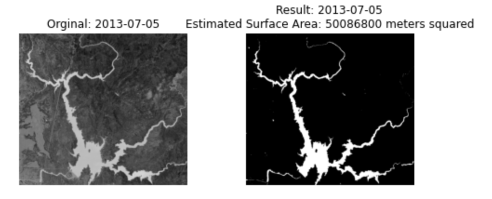
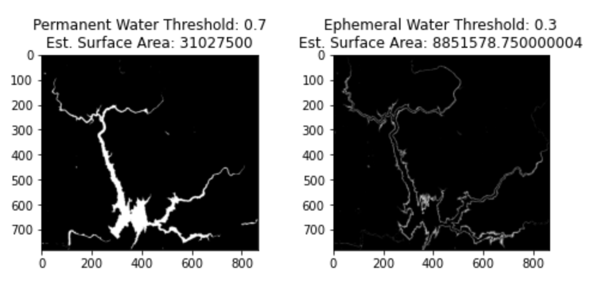

## **Results**

        <b>Successfully Thresholded Image</b>

    

        <b>Thresholded Image with Missing Data</b>

    

        <b>Thresholded Image with Cloud Noise</b>

    

    After discarding images with missing data and noise, we performed more analysis on the successfully classified images. Specifically we looked to determine where the permanent and ephemeral water resided within Lake Oroville. To clarify, ephemeral water is water that only flows in response to precipitation and lacks a clearly defined channel. We defined ephemeral water as water that does not appear in greater than 70% of our images. 

        <b>Permanent Water with Threshold of 70%</b>

    

